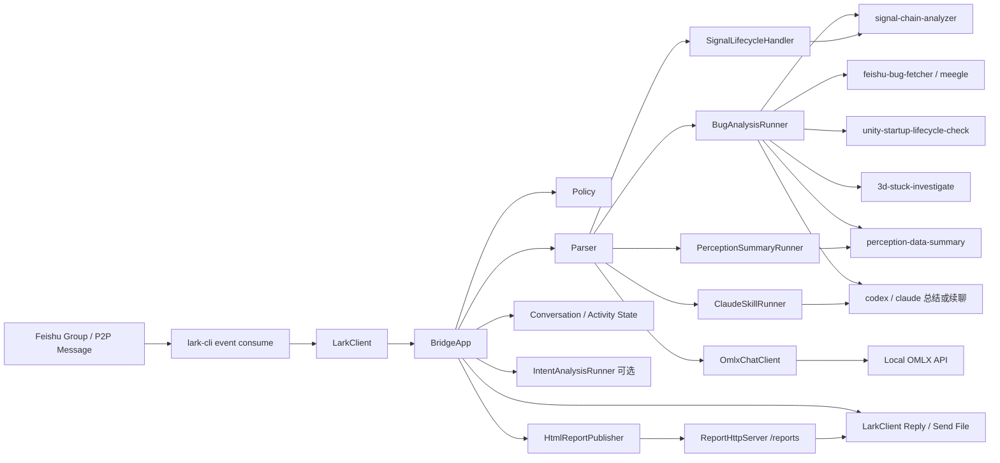
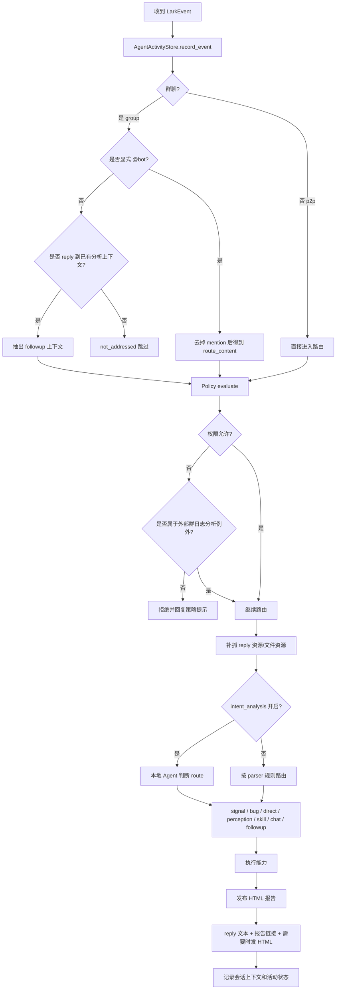
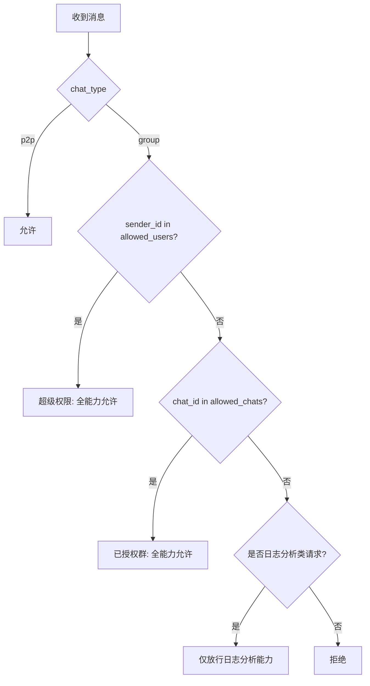
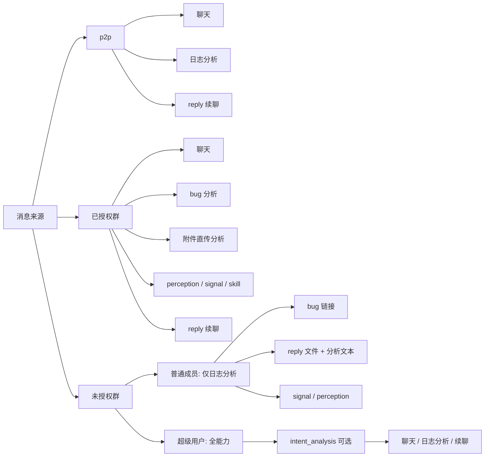
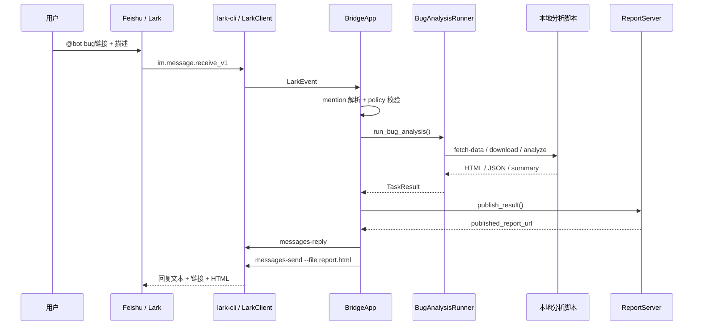
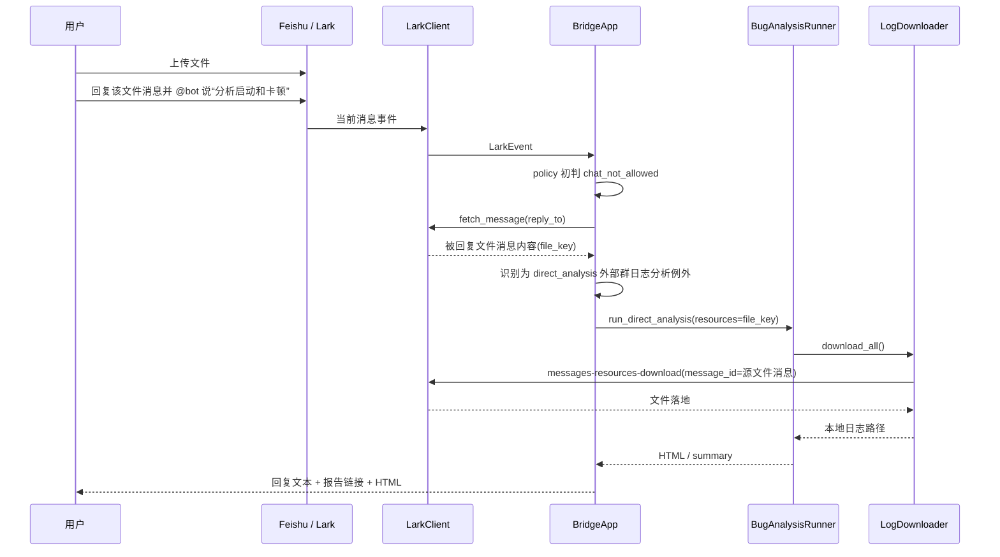
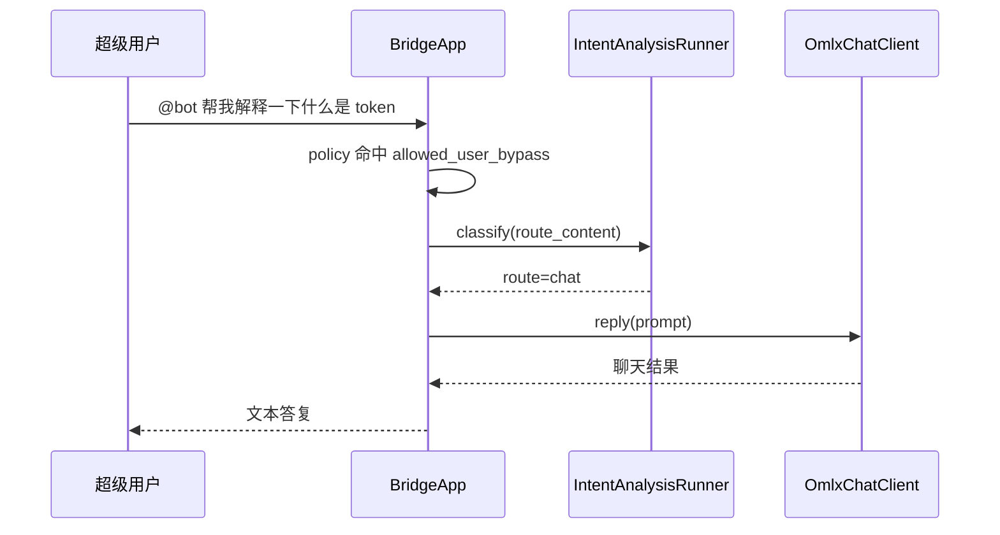
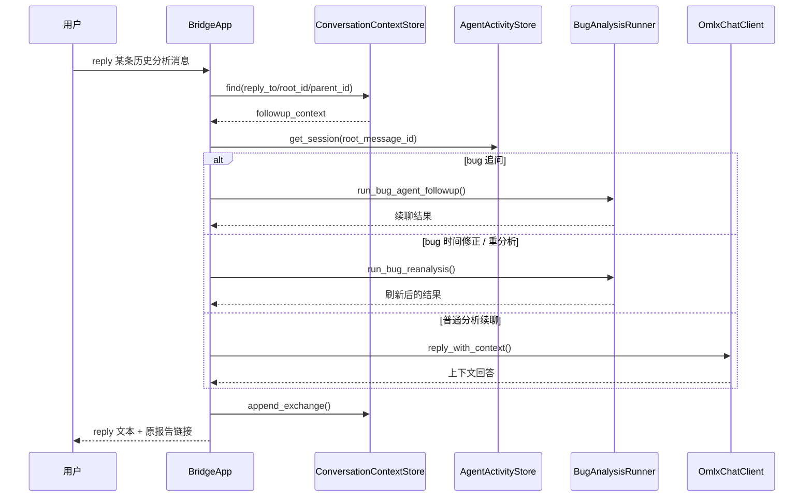

# Lark Agent Bridge 项目总览

本文档按当前代码实现总结 `tools/lark-agent-bridge` 的整体架构、消息路由、权限规则、状态持久化和典型场景。

适用代码范围：

- [lark_agent_bridge/app.py](/Users/zhuyl/Documents/workspace/tools/lark-agent-bridge/lark_agent_bridge/app.py)
- [lark_agent_bridge/agents.py](/Users/zhuyl/Documents/workspace/tools/lark-agent-bridge/lark_agent_bridge/agents.py)
- [lark_agent_bridge/policy.py](/Users/zhuyl/Documents/workspace/tools/lark-agent-bridge/lark_agent_bridge/policy.py)
- [lark_agent_bridge/parser.py](/Users/zhuyl/Documents/workspace/tools/lark-agent-bridge/lark_agent_bridge/parser.py)
- [lark_agent_bridge/state.py](/Users/zhuyl/Documents/workspace/tools/lark-agent-bridge/lark_agent_bridge/state.py)
- [lark_agent_bridge/report_server.py](/Users/zhuyl/Documents/workspace/tools/lark-agent-bridge/lark_agent_bridge/report_server.py)
- [lark_agent_bridge/lark_client.py](/Users/zhuyl/Documents/workspace/tools/lark-agent-bridge/lark_agent_bridge/lark_client.py)

---

## 1. 项目定位

`Lark Agent Bridge` 是一个本地运行的飞书机器人桥接层。它不直接把飞书消息当成“任意命令执行器”，而是把消息限制在一组可控能力里，再把本地脚本、只读 Agent、OMLX 模型和 HTML 报告回传能力串起来。

它解决的是这类闭环：

1. 飞书收到消息
2. 根据权限和消息意图决定是否处理
3. 如果是日志分析，就下载/复用日志并触发本地分析
4. 产出 HTML 报告
5. 通过飞书回复文本和报告链接，必要时附带 HTML 文件
6. 保存上下文，用于后续 reply 续聊和复分析

---

## 2. 当前支持的能力面

### 2.1 核心能力

1. `signal_lifecycle`
   - 根据 `SignalCode / SIGNAL_*` + 日志资源触发信号链分析
2. `bug_analysis`
   - 根据飞书 bug 链接触发 bug 拉取、日志下载、分类分析、报告生成
3. `direct_analysis`
   - 基于飞书文件/图片/URL 的直传日志分析
4. `perception_summary`
   - 汇总当前感知数据统计
5. `claude_skill`
   - 通过 `/skill` 或 `/claude` 触发本地只读分析
6. `omlx_chat`
   - 普通聊天
7. `analysis_followup`
   - 对已有分析结果做续聊、追问或重分析

### 2.2 bug 分析内部路由

`bug_analysis` 内部还会再细分：

1. `startup`
2. `stuck`
3. `startup + stuck` 合并
4. `crash`
5. `signal`
6. `perception`

其中 `startup + stuck` 当前对外主产物是一个合并 HTML。

---

## 3. 核心模块分层

| 模块 | 作用 |
|---|---|
| `cli.py` | 命令行入口，提供 `check / handle-event / run-signal / listen` |
| `app.py` | 总调度器，负责权限判断、消息路由、状态更新、回包 |
| `parser.py` | 文本解析，把消息解析成 `bug / direct / signal / perception / skill / chat` 请求 |
| `policy.py` | 权限闸门，决定当前消息是否允许进入能力面 |
| `agents.py` | 本地分析执行层，封装 `codex / claude / omlx` 和 bug 分析脚本 |
| `downloader.py` | 下载飞书资源、URL 资源、本地资源 |
| `lark_client.py` | `lark-cli` 包装层，负责收消息、回消息、取消息、下附件 |
| `state.py` | 去重状态、会话上下文、Agent 进度活动流 |
| `report_server.py` | 发布 HTML 报告，并提供 `/reports` 和 `/sessions` 本地 HTTP 服务 |

---

## 4. 总体架构图

---

## 5. 入口流程图

---

## 6. 权限模型

### 6.1 权限优先级

当前权限有三层：

1. `p2p`
   - 默认允许
2. `allowed_users`
   - 超级权限用户，跨群放行
3. `allowed_chats`
   - 已授权群，完整能力放行

再往下是一个例外层：

4. 非授权群里的“日志分析类请求”
   - 只放行特定分析能力，不放行通用聊天/普通问答

### 6.2 权限框架图

### 6.3 当前实现语义

- `allowed_chats`
  - 代表“机器人已在该群完成授权，完整能力可用”
- `allowed_users`
  - 代表“超级用户，跨群 bypass”
- 非授权群普通用户
  - 现在只能用日志分析相关触发面

---

## 7. 场景框架图

---

## 8. 典型时序图

### 8.1 已授权群内 bug 链接分析

### 8.2 未授权群里，回复文件消息并 @ 机器人

### 8.3 超级用户在任意群里 @ 机器人普通聊天

### 8.4 reply 续聊 / 复分析

---

## 9. 模块间职责边界

### 9.1 `BridgeApp`

`BridgeApp` 是唯一总调度入口，职责包括：

1. 处理 `group / p2p`
2. 识别 `@bot`
3. 调用 `policy`
4. 必要时补抓 reply 资源
5. 调 `intent_analysis`
6. 路由到具体能力执行器
7. 发布 HTML 报告
8. 回包
9. 记录会话和进度

### 9.2 `parser`

`parser` 只做轻量文本结构提取，不做权限判断，也不执行任务。

### 9.3 `policy`

`policy` 只解决“能不能进”，不决定“该走哪条能力”。

### 9.4 `agents`

`agents.py` 里有三类执行器：

1. `OmlxChatClient`
2. `IntentAnalysisRunner`
3. 各种分析 runner
   - `ClaudeSkillRunner`
   - `BugAnalysisRunner`
   - `PerceptionSummaryRunner`

### 9.5 `state`

`state.py` 有三类状态：

1. `EventStateStore`
   - 去重
2. `ConversationContextStore`
   - 分析结果续聊上下文
3. `AgentActivityStore`
   - 活动进度流、会话列表、`/sessions` 数据源

---

## 10. 当前消息触发面

### 10.1 直接文本触发

- `@bot /signal 132002 ...`
- `@bot https://project.feishu.cn/.../buglo/detail/... 调查3D启动时序`
- `@bot 分析启动和卡顿 file_xxx`
- `@bot /perception-summary 总结当前感知数据 file_xxx`
- `@bot /skill 分析这个目录`
- `@bot /chat 讲个笑话`

### 10.2 reply 触发

- reply 分析结果消息继续追问
- reply 文件消息并要求分析
- reply 历史 bug 结果并修正时间，触发复分析

### 10.3 当前续聊约束

- 群聊：必须 reply 某条消息并 `@bot`
- 私聊：必须 reply 某条消息，不强制 `@`
- 不再允许“同群最近一次上下文自动续聊”

---

## 11. 当前设计亮点

1. **能力面收口**
   - 不是通用 shell bot，而是有限能力桥接器
2. **重活脚本化**
   - bug / signal / perception 走本地脚本，不把稳定性押在 agent 自由发挥上
3. **Agent 只做更适合 Agent 的事**
   - 意图路由
   - bug 结论总结
   - 续聊复用
4. **reply 链路优先**
   - 续聊上下文明确，不依赖模糊“最近一次”
5. **HTML 发布统一**
   - 群里不用传本地路径，直接走可访问报告链接

---

## 12. 当前边界和限制

1. `intent_analysis` 是可选层，不是默认必开
2. 并不是所有分析都完全由 agent 执行
   - 核心分析仍由本地脚本执行
3. 外部群普通成员目前只放行日志分析，不放行通用聊天
4. 本地 `report_server` 测试在当前环境仍有一个已知问题
   - `tests/test_report_server.py`
   - `PermissionError: [Errno 1] Operation not permitted`
   - 这是本地端口绑定环境问题，不是主流程逻辑错误

---

## 13. 推荐你后续继续收的方向

1. **把“群授权”从静态 `allowed_chats` 升级成持久化授权表**
   - 支持申请、审批、撤销
2. **把“超级用户”从 `allowed_users` 升级成显式 `super_users` 配置**
   - 语义更清楚
3. **给外部群日志分析加更清晰的能力白名单**
   - 明确哪些 route 可用
4. **补一页面向使用者的《触发矩阵》**
   - 群 / 私聊 / 授权群 / 外部群 / 超级用户 各自支持什么
5. **补 `report_server` 的非绑定端口测试替身**
   - 把当前 CI/本地环境不稳定点摘掉

