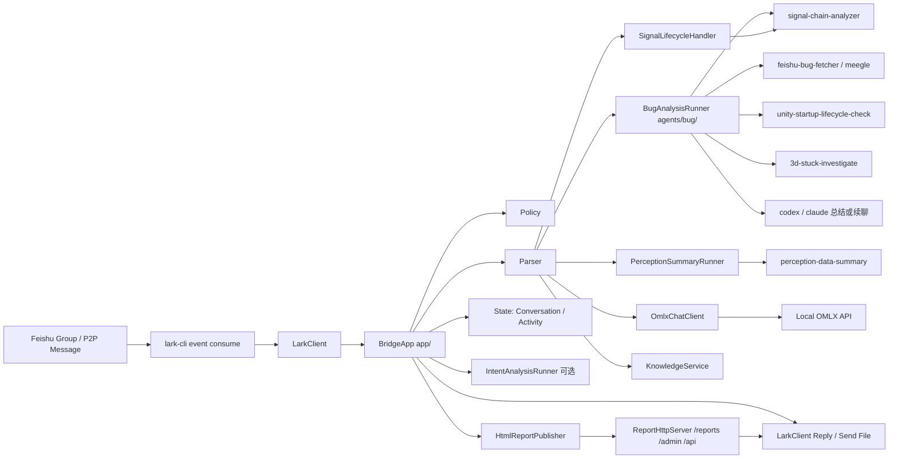
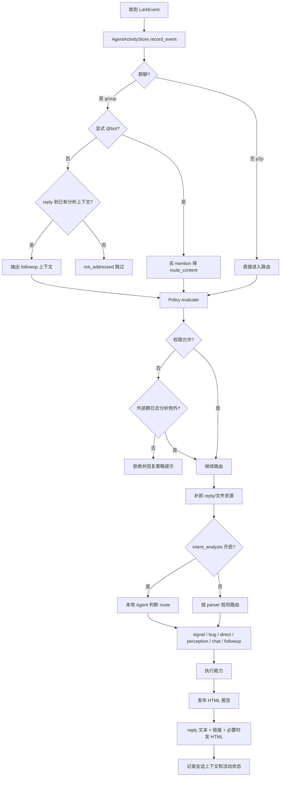
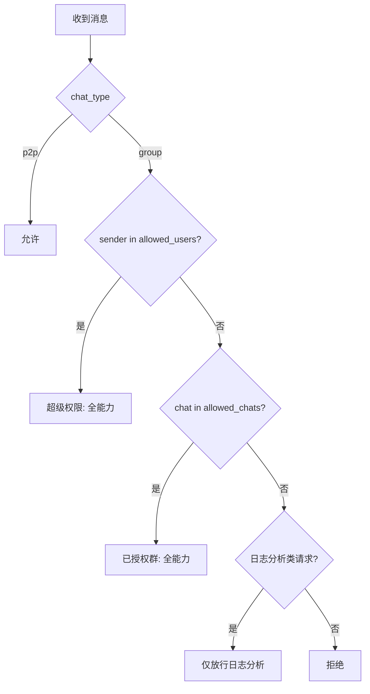
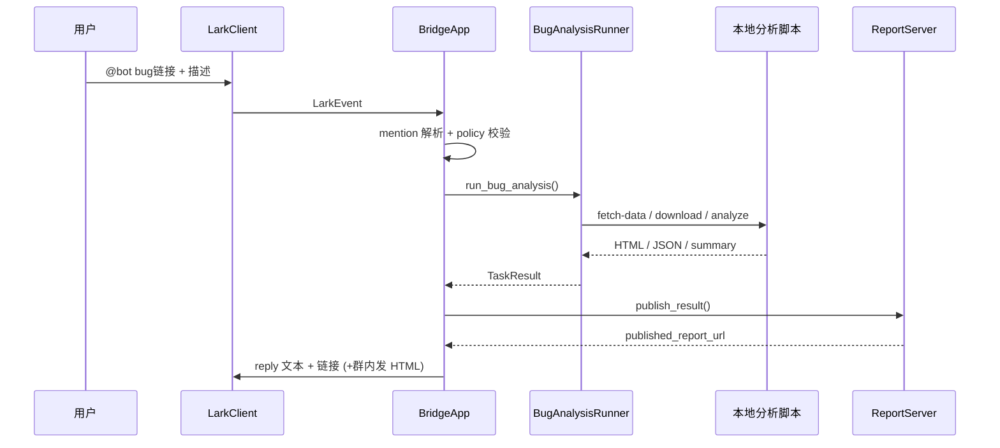
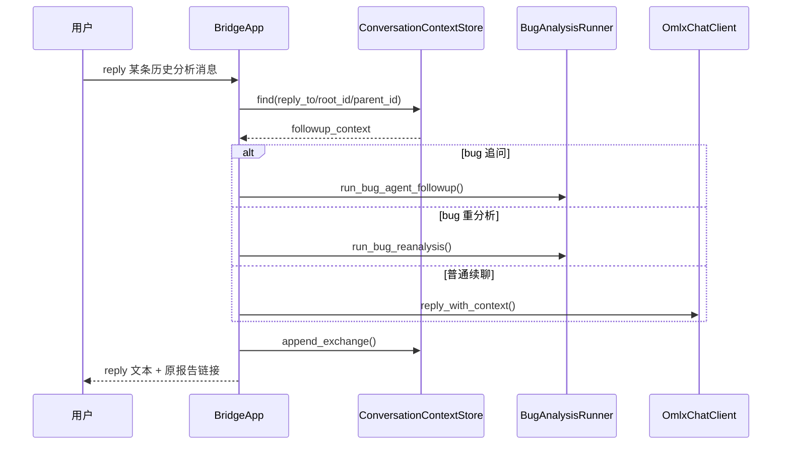

# Lark Agent Bridge 项目总览

本文档按 **当前真实代码实现**（`lark_agent_bridge/` 包）总结整体架构、消息路由、权限规则、状态持久化与典型场景。

> 维护约定：本文件只描述「现状」。目标架构、解耦原则、迁移路线图见
> [architecture-refactor-blueprint.md](./architecture-refactor-blueprint.md)。
> 历史遗留的 `docs/project-overview-architecture.html` 描述的是早期 `app.py` / `agents.py`
> 单文件形态，已过期，请以本 `.md` 为准。

---

## 1. 项目定位

`Lark Agent Bridge` 是一个本地运行的飞书机器人桥接层。它不是通用 shell 执行器，而是把飞书消息约束在一组**可控能力**里，再把本地脚本、Bug 总结 Agent、OMLX 模型、知识库与 HTML 报告回传能力串起来。

闭环：

1. 飞书收到消息
2. 按权限和意图决定是否处理
3. 日志类任务下载/复用日志并触发本地分析脚本
4. 产出 HTML 报告
5. 通过飞书回复文本 + 报告链接，必要时附带 HTML 文件
6. 保存上下文用于后续 reply 续聊和复分析

---

## 2. 真实包结构

代码已从早期的 `app.py` / `agents.py` 单文件演进为分包结构。包根目录 `lark_agent_bridge/`。

### 2.1 顶层模块（节选，按职责）

| 模块 | 行数 | 职责 |
|---|---:|---|
| `cli.py` | 229 | 命令行入口：`check / handle-event / run-signal / listen / knowledge` |
| `config.py` | 1000 | TOML 配置加载、preset/profile 解析、环境变量覆盖 |
| `models.py` | 941 | 领域数据模型（请求/结果/事件/作业上下文 dataclass） |
| `parser.py` | 1237 | 文本解析：把消息解析为 bug/direct/signal/perception/chat/followup 请求 |
| `policy.py` | 33 | 权限闸门：是否允许进入能力面 |
| `report_server.py` | 1494 | HTML 报告发布 + 本地 HTTP 服务（`/reports`、`/admin`、`/api/*`） |
| `lark_client.py` | 723 | `lark-cli` 包装：收消息、回消息、取消息、下附件、事件消费守护 |
| `state.py` | 961 | 事件去重、会话上下文、Agent 活动进度流 |
| `cards.py` | 970 | 飞书交互卡片构造 |
| `lifecycle.py` / `case_store.py` / `report_version.py` | 381/500/318 | 分析生命周期、案例库、报告版本 |
| `health.py` | 671 | 监听器健康、进程看护 |
| `log_analyzer.py` | 662 | 直传日志分析 |
| `requirement_analysis.py` / `source_analysis.py` / `app_server_investigation.py` | 630/270/850 | 需求分析 / 仓库源码分析 / app-server 调查 |
| `approval.py` / `escalation.py` / `arbitration.py` / `workflow_archive.py` | 398/368/290/239 | 审批、升级通知、双 Agent 仲裁、Feishu 归档 |
| `downloader.py` / `signal_resolver.py` / `evidence_logs.py` | 295/280/225 | 资源下载、信号解析、证据日志保全 |
| 其余 | — | `auth/replay/runner/skill_manager/skill_registry/profile_registry/token_usage/log/network_env/admin_ui/mcp_codegraph_server/prompt_snapshots` |

### 2.2 子包

| 子包 | 内容 | 说明 |
|---|---|---|
| `app/` | `BridgeApp` 总调度器 | 由 5 个 Mixin 组合（见 §10） |
| `agents/` | 本地分析执行层 | `OmlxChatClient`、`IntentAnalysisRunner`、`ClaudeSkillRunner`、`Addr2LineRunner`、`PerceptionSummaryRunner`、`RomVersionLookupRunner`、LLM/Codex 运行时、路由词表 |
| `agents/bug/` | `BugAnalysisRunner` | 由 13 个 Mixin 组合（见 §11） |
| `handlers/` | `SignalLifecycleHandler` | 信号生命周期处理 |
| `reporting/` | 结构化报告组合 | `composition`、`planners`、`combined_bug_html`、`source_report_html`、`requirement_report_html` |
| `knowledge/` | 个人知识库 | `service`、`store`、`ingestors`、`code_index`、`codegraph_client`、`source_investigation` |

### 2.3 `app/` 包内文件

| 文件 | 行数 | 角色 |
|---|---:|---|
| `__init__.py` | 18 | 组合 `BridgeApp` |
| `_shared.py` | 462 | 共享 import 聚合 + 路由上下文 dataclass（`_RouteContext` 等） |
| `handle_event.py` | 1750 | 事件入口、mention 解析、路由分发 |
| `log_resources.py` | 1460 | 日志资源补抓与下载编排 |
| `result_bug.py` | 1445 | bug 结果发布、报告回包 |
| `context_from.py` | 1107 | reply 上下文抽取、续聊上下文构建 |
| `replay_flow.py` | 357 | 复分析（replay）流程 |

### 2.4 `agents/bug/` 包内文件（13 Mixin）

| 文件 | Mixin | 行数 | 职责 |
|---|---|---:|---|
| `_shared.py` | 共享 import/常量 | 729 | — |
| `resolve_source.py` | `_ResolveSourceMixin` | 1233 | 定位 bug 源 |
| `run_primary.py` | `_RunPrimaryMixin` | 936 | 主分析路径 `run_bug_analysis` |
| `run_reanalysis.py` | `_RunReanalysisMixin` | 1080 | 重分析 + Agent 续聊 |
| `agent_summary.py` | `_AgentSummaryMixin` | 1376 | Agent 总结执行/用量/运行时 HTML |
| `bug_cache.py` | `_BugCacheMixin` | 1397 | bug 缓存 |
| `archive_extract.py` | `_ArchiveExtractMixin` | 1376 | 解压日志附件 |
| `general_summary.py` | `_GeneralSummaryMixin` | 1407 | 结构化总结 |
| `signal_android.py` | `_SignalAndroidMixin` | 1402 | 信号/安卓分诊 |
| `custom_skill.py` | `_CustomSkillMixin` | 1087 | 自定义 skill 执行 |
| `ld_executor.py` | `_LdExecutorMixin` | 1441 | 本地脚本执行 |
| `bug_prompt.py` | `_BugPromptMixin` | 1525 | Agent prompt 构建 |
| `direct_api.py` | `_DirectApiMixin` | 1350 | 直连 API 执行 |
| `render_bug.py` | `_RenderBugMixin` | 785 | 报告渲染 |

> 历史上的 `run_bug` / `run_bug_2` / `run_bug_3` 是**按行数硬切**的命名，已按业务语义重命名为
> `run_primary` / `run_reanalysis` / `agent_summary`（阶段三任务 8）。各 Mixin 之间无 import 依赖，
> 仅在 `bug_runner.py` 组合时通过 `self` 共享状态。

### 2.5 文件大小硬约束

`tests/test_file_size_boundaries.py` 强制所有 git 跟踪的 `.py` 文件 **≤ 2000 行**（`MAX_PYTHON_FILE_LINES = 2000`）。任何拆分/合并都必须保持此红线。

---

## 3. CLI 入口

`cli.py` 提供 5 个子命令：

| 命令 | 作用 |
|---|---|
| `check` | 校验本地配置与 `lark-cli` 可用性，打印 `userOpenId` |
| `handle-event --event X.json [--dry-run]` | 处理单条飞书事件 JSON |
| `run-signal --signal S --log-path P` | 直接跑信号生命周期分析 |
| `listen` | 监听 `im.message.receive_v1` 事件，并起本地报告服务 + 清理循环 |
| `knowledge {sync,sources,search,answer,add,add-source}` | 知识库管理与查询 |

`listen` 还以守护方式管理 `lark-cli event consume`：等待 `ready` 标记、保持 stdin、记录健康、按退避重启失败的消费者。

---

## 4. 能力面与触发矩阵

### 4.1 核心能力

| 能力 | 触发 | 产物 |
|---|---|---|
| `signal_lifecycle` | `SignalCode / SIGNAL_*` + 日志资源 | 信号链分析 HTML |
| `bug_analysis` | `project.feishu.cn/.../buglo/detail/...` 链接 + 描述 | 分类分析 HTML |
| `direct_analysis` | 附件 / Drive / 图片 / URL / 授权本地文件名 + 分析方向 | 日志分析 HTML |
| `perception_summary` | "总结当前感知数据" + 日志资源 | 感知汇总 HTML |
| `omlx_chat` | 普通短问题（私聊直发，群聊需 `chat`/`/chat`） | 文本 |
| `analysis_followup` | reply 已有分析结果并 `@bot` | 续聊 / 复分析 |
| 知识库 QA | `知识库` / `查知识`（`/kb` `/qa` 兼容） | 卡片（答案 + 命中来源） |
| 基础回复 | `你是谁` / `帮助` | 文本 |

### 4.2 bug 分析内部路由（URL 触发，短描述决定路线）

| 路线 | 触发词 | 产物 |
|---|---|---|
| startup | 启动/时序/首帧/UnityReady/displayChanged/startRender | `bug_3d_startup_report.html` |
| stuck | 卡顿/卡死/掉帧/黑屏/ANR/不刷新 | `bug_3d_stuck_report.html` |
| startup+stuck 合并 | 同时命中两者 | `bug_startup_stuck_report.html`（合并页 + 子报告） |
| crash | 闪退/crash/tombstone/FATAL EXCEPTION/SIGSEGV | `bug_crash_report.html` |
| signal | 信号/数据链/链路/没到Unity + 具体信号码或枚举 | `bug_signal_chain_report.html` |
| fallback | 无明确方向 | 请用户补充方向；有具体代码/日志范围则做有界三级分诊 |

### 4.3 权限维度触发矩阵

| 来源 | 普通聊天 | 日志分析 | reply 续聊 |
|---|:--:|:--:|:--:|
| p2p 私聊 | ✓ | ✓ | ✓ |
| 已授权群（`allowed_chats`） | ✓ | ✓ | ✓ |
| 超级用户（`allowed_users`，任意群） | ✓ | ✓ | ✓ |
| 未授权群普通成员 | ✗ | ✓（仅日志分析例外） | ✓ |

---

## 5. 核心调度分层

| 层 | 模块 | 职责边界 |
|---|---|---|
| 入口 | `cli.py` | 解析命令、装配 `BridgeApp` |
| 调度 | `app/`（`BridgeApp`） | 权限判断、路由、补抓资源、发布报告、回包、记录状态 |
| 解析 | `parser.py` | 仅做文本结构提取，不判权限、不执行 |
| 权限 | `policy.py` | 只解决"能不能进"，不决定"走哪条能力" |
| 执行 | `agents/`、`handlers/`、`log_analyzer.py` 等 | 具体分析执行器 |
| 报告 | `reporting/` + `report_server.py` | 结构化组合 + HTML 发布 + HTTP 服务 |
| 状态 | `state.py`、`case_store.py`、`lifecycle.py` | 去重、上下文、活动流、案例、生命周期 |
| 知识 | `knowledge/` | 本地 SQLite 知识索引与来源调查 |

---

## 6. 总体架构图


```mermaid
flowchart LR
    A[Feishu Group / P2P Message] --> B[lark-cli event consume]
    B --> C[LarkClient]
    C --> D[BridgeApp app/]

    D --> E[Policy]
    D --> F[Parser]
    D --> G[State: Conversation / Activity]
    D --> H[IntentAnalysisRunner 可选]

    F --> I[SignalLifecycleHandler]
    F --> J[BugAnalysisRunner agents/bug/]
    F --> K[PerceptionSummaryRunner]
    F --> M[OmlxChatClient]
    F --> KB[KnowledgeService]

    J --> N[feishu-bug-fetcher / meegle]
    J --> O[unity-startup-lifecycle-check]
    J --> P[3d-stuck-investigate]
    J --> Q[signal-chain-analyzer]
    J --> S[codex / claude 总结或续聊]

    I --> Q
    K --> R[perception-data-summary]
    M --> T[Local OMLX API]

    D --> U[HtmlReportPublisher]
    U --> V[ReportHttpServer /reports /admin /api]
    D --> W[LarkClient Reply / Send File]
    V --> W
```

---

## 7. 入口流程图


```mermaid
flowchart TD
    A[收到 LarkEvent] --> B[AgentActivityStore.record_event]
    B --> C{群聊?}
    C -- 否 p2p --> D[直接进入路由]
    C -- 是 group --> E{显式 @bot?}
    E -- 否 --> F{reply 到已有分析上下文?}
    F -- 否 --> G[not_addressed 跳过]
    F -- 是 --> H[抽出 followup 上下文]
    E -- 是 --> I[去 mention 得 route_content]
    H --> J[Policy evaluate]
    I --> J
    D --> J
    J --> K{权限允许?}
    K -- 否 --> L{外部群日志分析例外?}
    L -- 否 --> Mr[拒绝并回复策略提示]
    L -- 是 --> N[继续路由]
    K -- 是 --> N
    N --> O[补抓 reply/文件资源]
    O --> P{intent_analysis 开启?}
    P -- 是 --> Q[本地 Agent 判断 route]
    P -- 否 --> R[按 parser 规则路由]
    Q --> S[signal / bug / direct / perception / chat / followup]
    R --> S
    S --> Tt[执行能力]
    Tt --> U[发布 HTML 报告]
    U --> V[reply 文本 + 链接 + 必要时发 HTML]
    V --> Wr[记录会话上下文和活动状态]
```

---

## 8. 权限模型

权限三层 + 一个例外层：

1. `p2p` 私聊：默认允许
2. `allowed_users`：超级用户，跨群 bypass
3. `allowed_chats`：已授权群，完整能力
4. 例外：未授权群的"日志分析类请求"只放行特定分析能力，不放行通用聊天


```mermaid
flowchart TD
    A[收到消息] --> B{chat_type}
    B -- p2p --> C[允许]
    B -- group --> D{sender in allowed_users?}
    D -- 是 --> E[超级权限: 全能力]
    D -- 否 --> F{chat in allowed_chats?}
    F -- 是 --> G[已授权群: 全能力]
    F -- 否 --> H{日志分析类请求?}
    H -- 是 --> I[仅放行日志分析]
    H -- 否 --> J[拒绝]
```

---

## 9. 典型时序

### 9.1 已授权群内 bug 链接分析


```mermaid
sequenceDiagram
    participant U as 用户
    participant C as LarkClient
    participant A as BridgeApp
    participant B as BugAnalysisRunner
    participant S as 本地分析脚本
    participant R as ReportServer
    U->>C: @bot bug链接 + 描述
    C->>A: LarkEvent
    A->>A: mention 解析 + policy 校验
    A->>B: run_bug_analysis()
    B->>S: fetch-data / download / analyze
    S-->>B: HTML / JSON / summary
    B-->>A: TaskResult
    A->>R: publish_result()
    R-->>A: published_report_url
    A->>C: reply 文本 + 链接 (+群内发 HTML)
```

### 9.2 reply 续聊 / 复分析


```mermaid
sequenceDiagram
    participant U as 用户
    participant A as BridgeApp
    participant Sx as ConversationContextStore
    participant B as BugAnalysisRunner
    participant O as OmlxChatClient
    U->>A: reply 某条历史分析消息
    A->>Sx: find(reply_to/root_id/parent_id)
    Sx-->>A: followup_context
    alt bug 追问
        A->>B: run_bug_agent_followup()
    else bug 重分析
        A->>B: run_bug_reanalysis()
    else 普通续聊
        A->>O: reply_with_context()
    end
    A->>Sx: append_exchange()
    A-->>U: reply 文本 + 原报告链接
```

---

## 10. `BridgeApp` 组合结构（现状）

`app/__init__.py` 把 5 个 Mixin 拼成 `BridgeApp`：

```
BridgeApp(
    _HandleEventMixin,   # handle_event.py  事件入口/路由
    _ReplayFlowMixin,    # replay_flow.py   复分析流程
    _ResultBugMixin,     # result_bug.py    bug 结果发布
    _LogResourcesMixin,  # log_resources.py 日志资源编排
    _ContextFromMixin,   # context_from.py  reply 上下文
)
```

> 各 Mixin 通过 `from ._shared import *` 共享标准库符号与跨包 re-export。`_shared.py`
> 的 `__all__` 当前**混入了标准库符号**（`dataclass/json/os/Path/re/...`），属于命名空间污染，
> 见重构蓝图阶段二。

---

## 11. `BugAnalysisRunner` 组合结构（现状）

`agents/bug_runner.py` 把 13 个 Mixin 拼成 `BugAnalysisRunner`（见 §2.4 表）。这是当前最大的"上帝类"，混合了源码定位、缓存、解压、脚本执行、prompt 构建、渲染等多个职责，是重构蓝图阶段三的核心目标。

---

## 12. 报告与知识库子系统

- **reporting/**：`composition.py` 定义 `ReportComposition/ReportSection/ReportVerdict` 结构化模型，`planners.py` 生成报告计划，`*_html.py` 渲染最终 HTML。
- **report_server.py**：`HtmlReportPublisher` 发布报告包，`ReportHttpServer` 提供 `/reports`、`/admin`（`/sessions` 兼容别名）、`/api/sessions|analysis-history|cases|skills|knowledge|daemon|health`。
- **knowledge/**：`service.py` 编排，`store.py` 落 SQLite，`ingestors.py` 摄入来源，`source_investigation.py` 在用户显式请求时用只读 Codex CLI 做源码调查。

---

## 13. 状态持久化

`state.py` 三类状态：

1. `EventStateStore` — 事件去重
2. `ConversationContextStore` — 分析结果续聊上下文
3. `AgentActivityStore` — 活动进度流、会话列表、`/api/sessions` 数据源

外加 `case_store.py`（案例库）、`lifecycle.py`（分析生命周期）、`report_version.py`（报告版本）。作业保留策略由 `[job_retention]` 控制。

---

## 14. 已知技术债（→ 重构蓝图）

1. `agents/bug/` 的 13-Mixin 上帝类（机械命名 `run_bug_2/3` 已重命名为 `run_reanalysis/agent_summary`；进一步组合化受测试 mock 路径耦合限制，见蓝图 §4.2）
2. `app/_shared.py` 与 `agents/bug/_shared.py` 的 `__all__` 命名空间污染
3. 多个文件逼近 2000 行硬上限（`handle_event.py` 1750、`source_investigation.py` 1738、`bug_prompt.py` 1525）
4. `report_server` 真实绑定端口的测试只处理 `PermissionError`，其余 `OSError` 会变 error 而非 skip

目标架构、解耦原则与分阶段迁移路线图见
[architecture-refactor-blueprint.md](./architecture-refactor-blueprint.md)。
